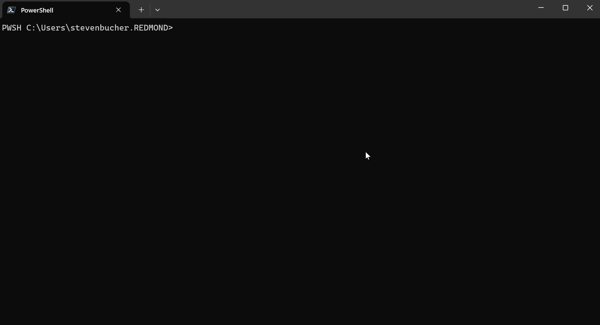

# ShellCopilot

```
███████╗██╗  ██╗███████╗██╗     ██╗      ██████╗ ██████╗ ██████╗ ██╗██╗      ██████╗ ████████╗
██╔════╝██║  ██║██╔════╝██║     ██║     ██╔════╝██╔═══██╗██╔══██╗██║██║     ██╔═══██╗╚══██╔══╝
███████╗███████║█████╗  ██║     ██║     ██║     ██║   ██║██████╔╝██║██║     ██║   ██║   ██║   
╚════██║██╔══██║██╔══╝  ██║     ██║     ██║     ██║   ██║██╔═══╝ ██║██║     ██║   ██║   ██║   
███████║██║  ██║███████╗███████╗███████╗╚██████╗╚██████╔╝██║     ██║███████╗╚██████╔╝   ██║   
╚══════╝╚═╝  ╚═╝╚══════╝╚══════╝╚══════╝ ╚═════╝ ╚═════╝ ╚═╝     ╚═╝╚══════╝ ╚═════╝ ╚═╝                                                                                             
```

This is a repository of various A.I + Shell prototypes we have created to test out experiences and
features. **ShellCopilot** is the latest and most finished prototype. It is a CLI tool that creates
an interactive chat session with a registered Large Language Model. 



## Installing and Using ShellCopilot

Here are the steps to install and use ShellCopilot.
1. Clone this repository
2. To build run `./build.ps1 -ShellCopilot` in the project's directory
3. Add the `<path to project>/out/ShellCopilot.App` directory to your `$PATH` with `$env:PATH += <path to project>\out\ShellCopilot.App`
4. Add the above line to your `$PROFILE` to be able to use it anytime you open up PowerShell. You can edit it by doing `code $PROFILE` if you have VSCode installed.

> Note: Depending on your OS directory paths may be `\` on Windows or `/` on Mac.

## Getting an Azure OpenAI Endpoint

Currently we only support Azure OpenAI LLM endpoints. We are currently hosting a internal only Azure
OpenAI endpoint that you can get and use without getting your Azure OpenAI instance. This is for private preview purposes only.

Guide for Signing Up For API Key
1.  Navigate to <https://pscopilot.developer.azure-api.net>
2.  Click `Sign Up` located on the top right corner of the page.
3.  Sign up for a subscription by filling in the fields (email, password, first name, last name).
4.  Verify the account (An email should have been sent from
    <apimgmt-noreply@mail.windowsazure.com> to your email)
5.  Click `Sign In` located on the top right corner of the page.
6.  Enter the email and password used when signing up.
7.  Click `Products` located on the top right corner of the page
8.  In the field stating `Your new product subscription name`, Enter `Azure OpenAI Service API`.
9.  Click `Subscribe` to be subscribed to the product.

In order to view your subscription/API key,
1.  Click `Profile` located on the top right corner of the page.
2.  Your Key should be located under the `Subscriptions` section. Click on `Show` to view the
    primary or secondary key.

To register an endpoint you can use the `aish register` subcommand.

```console
aish register --name <Name Of Model> --endpoint https://pscopilot.azure-api.net --key <Insert Key From Above Steps> --deployment gpt4 --openai-model gpt-4-0314 --system-prompt <Add Whatever System Prompt you want to guide the LLM>
```

For the private preview we are letting users use a GPT-4 model at the
`https://pscopilot.azure-api.net` with the above configurations.

If you have separate Azure OpenAI endpoint you can use that instead of the one above. Read more at
[Create and deploy an Azure OpenAI Service resource](https://learn.microsoft.com/en-us/azure/ai-services/openai/how-to/create-resource?pivots=ps).

## Using ShellCopilot

To start a chat session with the LLM, simply run `aish` and it will open up a new session in your current window. You can also use `aish --use-alt-buffer` to open up a new chat session in the alternate screen buffer. 

To explore the other options available to you, run `aish --help` to see all the subcommands.

# PowerShell Copilot 

**PowerShell Copilot** was the first prototype we created. It is a PowerShell module that allows you
to also have an interactive chat session with an LLM. It has slightly different UX/UI than
ShellCopilot and is specific to PowerShell.

To use PSCopilot, 
1. Run `./build.ps1 -PSCopilot` to build the module
2. Import the module via `Import-Module ./out/Microsoft.PowerShell.Copilot`
3. Set `$env:AZURE_OPENAI_API_KEY = <YOUR KEY>` to the key you got from the previous steps above. 
4. Add steps 2 and 3 to your `$PROFILE` to be able to use it anytime you open up PowerShell.
5. Run `Enable-PSCopilotKeyHandler` to set `F3` to the key to enter and exit the session
6. Press `F3` and start chatting!

You can use `Ctrl+C` to copy any code from the LLMs to your clipboard. You can also set additional
prompt context to `$env:AZURE_OPENAI_SYSTEM_PROMPT` to better ground the LLM.
