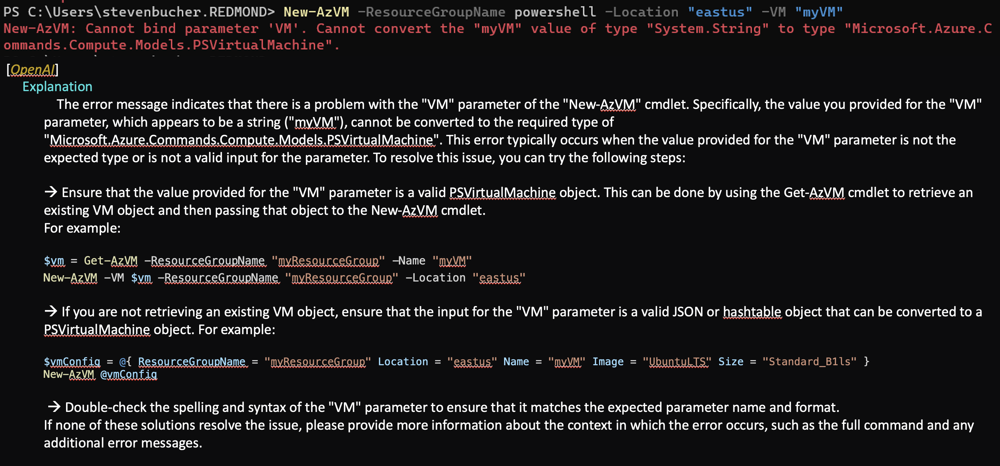

# AI CLI Scenarios

This document outlines the different scenarios in a CLI experience that would benefit from
Artificial Intelligence (AI) assistance and more tailored prompt engineering.

## User Story

As a PowerShell developer, I want to have an AI-enhanced CLI experience that can understand my
intent, provide relevant suggestions, and improve my productivity.

## Current Experience

The current CLI experience lacks AI assistance, leaving users to rely on their own knowledge and
expertise when interacting with PowerShell commands. This can result in a steep learning curve,
especially for new users, and reduced productivity for experienced users.

## Enhanced Experience

An AI-enhanced CLI experience will provide users with intelligent suggestions, automatic command
completion, and natural language understanding for a more intuitive and efficient interaction with
PowerShell commands. The purpose of this document is to outline a number of these scenarios to
understand what requirements each may have from an engineering and design perspective. To keep
consistent with some of the **IntelligentShell** solution areas, we will include each scenarios
category. For reference the four areas are:
1. Shell Assistance
2. Error Recovery
3. Error Prevention
4. Roaming Profile

### Scenario 1: Intelligent Suggestions

The AI-enhanced CLI will analyze the user's input and provide relevant suggestions based on their
command history, context, and available commands. This will help users discover new commands and
options, as well as reduce the need to memorize or look up command syntax.

Example pre-execution:

```powershell
Get-ChildItem -<TAB>
```

The AI-enhanced CLI will provide suggestions for available parameters and values, such as `-Path`, `-Filter`, and `-Recurse`. This falls under the **Shell Assitant** bucket.

Example post-execution:


### Scenario 2: Automatic Command Completion

The AI-enhanced CLI will automatically complete commands and parameters based on the user's input
and context. This will help users save time and reduce the likelihood of errors due to incorrect
syntax. 

Example:

```powershell
Get-Process | Stop-<TAB>
```

The AI-enhanced CLI will automatically complete the command as `Stop-Process`. This falls under the **Shell Assitant** bucket.

### Scenario 3: Natural Language Understanding

The AI-enhanced CLI will understand natural language input and translate it into PowerShell
commands. This will enable users to interact with PowerShell using more intuitive and human-like
language, rather than having to learn and use specific command syntax. This falls under the **Shell
Assitant** bucket. 

Example:

```powershell
>Show me all files in the current directory
```

The AI-enhanced CLI will translate the natural language input into the appropriate PowerShell
command, such as `Get-ChildItem`. This is similar to the current prototype experience for asking
question in an alternate screen buffer. This falls under the **Shell Assitant** bucket.

### Scenario 4: Natural Langauge Error Explanation and Recovery

The AI enhanced CLI will get the error message that just occured in the shell and then provide a better natural language explanation of what happened and provide remediation steps if possible.

Example:


The shell will translate the error into more digestable wording and provide potential error recovery
steps to give the user remediation cmds to run.

### Scenario 5: Error prevention indications

The AI-enhanced CLI will be able to assist the user by attempting to prevent error

```powershell
# Commands not found on the system could be identified and highlighted
>Get-Cntent -Path ~/myfile.txt #(the typo to the left is underlined)
```

### Scenario 6: Roaming Profile

## Requirements Table

| Requirement | Description | Priority |
| --- | --- | --- |
| 1. Intelligent Suggestions | Implement AI-powered suggestions for commands and parameters based on user input and context. | 0 |
| 2. Automatic Command Completion | Enable AI-powered automatic command completion based on user input and context. | 1 |
| 3. Natural Language Understanding | Implement AI-powered natural language understanding for translating user input into PowerShell commands. | 2 |
| 4. Extensibility | Ensure the AI-enhanced CLI experience can be extended and customized by third-party developers and modules. | 2 |
| 5. Performance | Optimize AI performance to minimize latency and ensure a seamless user experience. | 1 |
| 6. Privacy | Ensure that user data and command history is securely stored and processed, adhering to privacy regulations and best practices. | 0 |


## Notes

what are top scenarios people would use AI for without realizing they are using AI

what type of problems you have resolving automation
??

Explore having different system prompts to have the chat sessison tuned to a type of helper..
- different kinds of helpers
 thinkg about different kind of doctors, therapist, physicians etc

 here are key use cases we want to solve today and here are the integration stuff that will help

 shell integration hides the implementation details that this is not powershell.

 Same expierence with other powershell 

 Start with the prompting stuff. 

 defining the use cases
 prompting for those use cases, setting those context

 https://learn.microsoft.com/en-us/azure/api-management/api-management-key-concepts

What is the most pain pointed error

## Shell Assitance
- Tab completion intelligence
    - Smarter Tab completion besides alphabetically
    - Cmd/cmdlets
    - parameters/flags
- Successful executions
- Comment questions


Develop OKRs for the AzPoliot 
## Error Prevention
- Prediction

## Error Recovery
