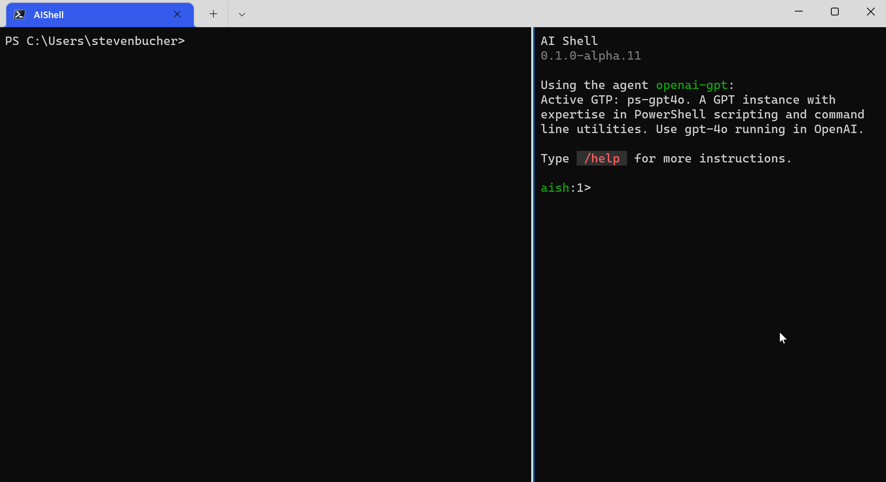

# Shell Integration Module

The `AIShell` module is a PowerShell module that creates a connection between PowerShell 7 and the
AIShell launched in a side car or your terminal. It allows for deeper integration with PowerShell
7's interactive ecosystem such as predictive intellisense. It also allows for cross pane
communication between the AIShell agent and the PowerShell to send queries, errors, and results between
the two shells. Here is a demo showing off its capabilities currently:


## Installation and Usage

This module gets built when you run the `build.ps1` script in the root of the repository. The module is outputted to the `out/debug/module` directory. To import the module, run the following command:

```powershell
Import-Module .\out\debug\module\AIShell
```

The module contains the following cmdlets:

- `Start-AIShell`
- `Resolve-Error`
- `Invoke-AIShell`

### Start-AIShell

This cmdlet starts an AIShell session in a split pane window of Windows Terminal or iTerm2 with a
connected communication channel with the session that started it. This is necessary to do to get any
of the shell integration features highlighted in the demo above.

### Resolve-Error

When you encounter and error in your working shell and are unsure what to do, instead of copying and
pasting the error message to the AIShell agent, you can run this cmdlet to send the error to the
agent for resolution. This sends the entire error object to the agent for analysis and resolution.
The `Start-AIShell` cmdlet must be run before this cmdlet can be used.

### Invoke-AIShell

This cmdlet allows you to send a query to the AIShell agent to execute. This is useful in case you do not want o


### /code post

One of the built in chat commands we have is the `/code` command. This command allows you to
interact with the code given by the assistance provider in an agent. There is a subcommand for this
command called `post` which allows you to post the code to the working shell and predictive
intellisense buffer of your working shell. Meaning you can run the code in your working shell and
get predictive intellisense the subsequent steps the agent provided.


